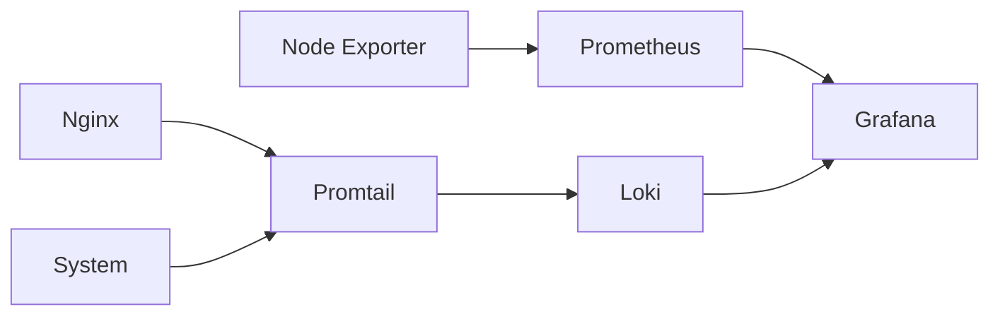

# 📊 Observability Stack with Docker (Prometheus + Grafana + Loki)

## Overview 

This project provides a complete observability stack using Docker Compose, combining metrics, logs, and visualization tools in a unified environment  

It includes:  

- Prometheus → Metrics collection
- Node Exporter → System-level metrics
- Grafana → Visualization and dashboards
- Loki → Log aggregation
- Promtail → Log shipping
- Nginx → Example service generating logs

This setup is commonly used in modern DevOps and cloud-native environments.

## 🧩 Architecture

The system is composed of the following components: 

Prometheus scrapes metrics from Node Exporter

Node Exporter exposes host system metrics (CPU, memory, disk, etc.)  

Loki stores and indexes logs  

Promtail collects logs from Docker containers and sends them to Loki  

Grafana connects to Prometheus and Loki to visualize metrics and logs  

Nginx acts as a sample service whose logs are monitored  



## Features

📈 Real-time system metrics monitoring

📉 Custom dashboards with Grafana

🧾 Centralized log aggregation with Loki

🔍 Log exploration and filtering

🐳 Docker-native logging integration

⚙️ Easily extendable architecture


## 📁 Project Structure

```text
.
compose.yaml
prometheus.yml
loki-config.yaml
promtail-config.yml
├── web/
│   └── index.html
|   └── images
├── screenshots/
└── README.md

```

PromtailPromtail
## ⚡ QuickStart

Get the full observability stack up and running in under 2 minutes.

1. Clone the repository

```
git clone https://github.com/Ismaelggc/monitoring.git
cd monitoring
```

2. Start the stack

```
docker compose up -d
```

3. Verify services are running

```
docker compose ps
```

All containers should be in Up state.

4. Access services

|Service|URL|
|-------|---|
|Grafana|http://localhost:3000|
|Nginx|http://localhost:8080|
|Prometheus|http://localhost:9090|

5. Grafana login
Username: admin
Password: admin

You will be prompted to change the password on first login.

<p align="center">
  
</p>

# Use Cases

Learning DevOps and observability fundamentals

Monitoring local development environments

Building a homelab setup

Demonstrating skills for technical interviews

Base architecture for production systems

## ⚠️ Notes

Volumes are used for data persistence

Do not commit sensitive data or credentials

Ensure ports are available before running

